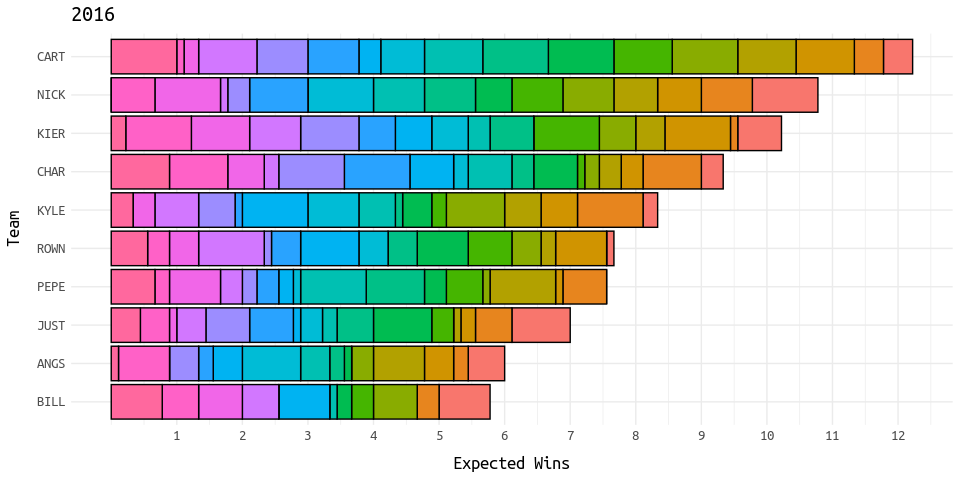

<!-- README.md is generated from README.Rmd. Please edit that file -->

# GAA

This is the repository for the GAA fantasy football league.

## Standings

### 2021

| Final | Team | Wins | Expected |  Points |
|:------|:-----|-----:|---------:|--------:|
| \#1   | CHAR |   10 |     10.8 | 1327.72 |
| \#2   | KIER |    7 |      9.6 | 1301.42 |
| \#3   | BILL |    9 |      9.6 | 1239.86 |
| \#4   | CART |    7 |      8.3 | 1280.12 |
| \#5   | CORE |    6 |      6.3 | 1057.90 |
| \#6   | ANGS |    4 |      8.1 | 1190.18 |
| \#7   | PEPE |    7 |      8.7 | 1270.70 |
| \#8   | KYLE |    4 |      5.4 | 1108.18 |
| \#9   | COLN |    6 |     10.0 | 1338.52 |
| \#10  | NICK |    5 |      8.2 | 1257.16 |

### 2020

| Final | Team | Wins | Expected |  Points |
|:------|:-----|-----:|---------:|--------:|
| \#1   | KYLE |    7 |     10.6 | 1249.84 |
| \#2   | BILL |    8 |      8.9 | 1379.38 |
| \#3   | CART |    6 |      8.9 | 1262.08 |
| \#4   | NICK |    6 |      7.9 | 1245.28 |
| \#5   | KIER |    5 |      8.0 | 1099.56 |
| \#6   | PEPE |    6 |      7.6 | 1149.80 |
| \#7   | ANGS |    6 |      7.4 | 1215.92 |
| \#8   | CORE |    4 |      4.9 | 1043.52 |

### 2019

| Final | Team | Wins | Expected |  Points |
|:------|:-----|-----:|---------:|--------:|
| \#1   | KIER |   10 |     10.0 | 1283.72 |
| \#2   | ANGS |    8 |     10.0 | 1260.68 |
| \#3   | PEPE |    7 |     10.4 | 1334.72 |
| \#4   | KYLE |    7 |      6.9 | 1189.18 |
| \#5   | CORE |    4 |      9.4 | 1249.98 |
| \#6   | BILL |    5 |      6.9 | 1120.22 |
| \#7   | NICK |    2 |      5.4 | 1017.62 |
| \#8   | CART |    5 |      5.0 | 1104.40 |

### 2018

| Final | Team | Wins | Expected |  Points |
|:------|:-----|-----:|---------:|--------:|
| \#1   | NICK |    8 |     10.0 | 1324.04 |
| \#2   | BILL |   10 |     13.0 | 1584.36 |
| \#3   | KIER |    9 |      7.4 | 1161.88 |
| \#4   | CHAR |    8 |      6.2 | 1086.32 |
| \#5   | PEPE |    5 |      8.0 | 1154.44 |
| \#6   | CART |    6 |      8.2 | 1221.88 |
| \#7   | ANGS |    5 |      7.9 | 1066.98 |
| \#8   | KYLE |    4 |     10.0 | 1286.52 |
| \#9   | COLN |    1 |      5.7 | 1024.30 |
| \#10  | ROWN |    4 |      3.6 |  950.54 |

### 2017

| Final | Team | Wins | Expected |  Points |
|:------|:-----|-----:|---------:|--------:|
| \#1   | NICK |    8 |      9.8 | 1191.28 |
| \#2   | CART |    7 |      8.4 | 1097.24 |
| \#3   | KIER |    9 |     10.8 | 1170.42 |
| \#4   | ROWN |    7 |      7.6 | 1130.06 |
| \#5   | PEPE |    4 |      8.3 | 1058.34 |
| \#6   | KYLE |    6 |      7.4 | 1032.26 |
| \#7   | CHAR |    3 |      7.0 | 1007.02 |
| \#8   | COLN |    6 |      5.3 |  992.88 |
| \#9   | BILL |    5 |      7.8 | 1092.68 |
| \#10  | ANGS |    5 |      7.6 | 1076.48 |

### 2016

| Final | Team | Wins | Expected |  Points |
|:------|:-----|-----:|---------:|--------:|
| \#1   | KIER |    8 |     10.2 | 1299.66 |
| \#2   | CART |   11 |     12.2 | 1426.80 |
| \#3   | CHAR |    8 |      9.3 | 1296.22 |
| \#4   | NICK |   10 |     10.8 | 1376.58 |
| \#5   | ROWN |    4 |      7.7 | 1178.78 |
| \#6   | JUST |    7 |      7.0 | 1185.52 |
| \#7   | PEPE |    6 |      7.6 | 1226.28 |
| \#8   | KYLE |    6 |      8.3 | 1259.50 |
| \#9   | BILL |    3 |      5.8 | 1044.90 |
| \#10  | ANGS |    2 |      6.0 | 1154.56 |

### 2015

| Final | Team | Wins | Expected | Points |
|:------|:-----|-----:|---------:|-------:|
| \#1   | CHAR |    7 |      8.7 |   1132 |
| \#2   | BILL |    8 |     10.3 |   1295 |
| \#3   | ROWN |    7 |      8.7 |   1192 |
| \#4   | KIER |   10 |     11.1 |   1396 |
| \#5   | ANGS |    3 |      5.7 |    999 |
| \#6   | PEPE |    6 |      8.7 |   1182 |
| \#7   | CART |    6 |      8.3 |   1210 |
| \#8   | JUST |    4 |      5.9 |   1177 |

## Wins

<!-- --><!-- --><!-- --><!-- --><!-- --><!-- --><!-- -->
